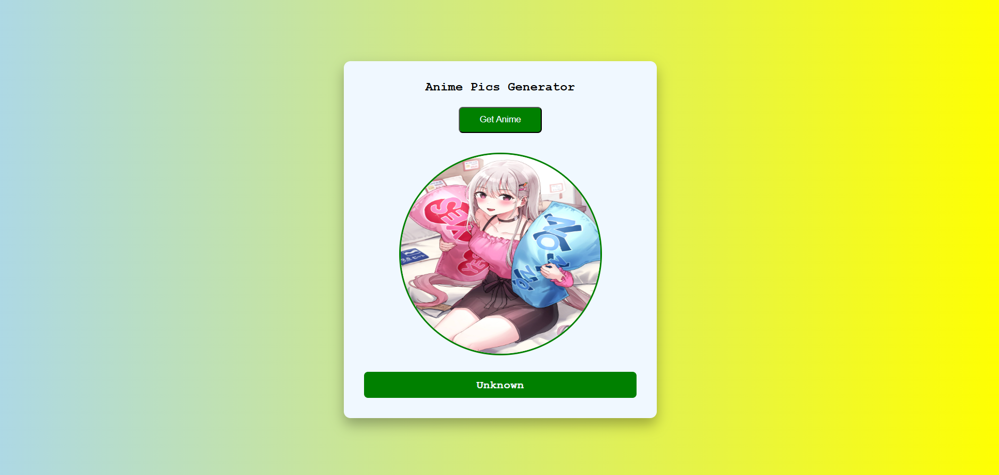

# 🎌 Anime Pics Generator

A fun and interactive web app that fetches and displays random anime images using the [Waifu.im API](https://waifu.im/). Built with HTML, CSS, and JavaScript.

---

## 🔗 Live Demo

🌐 [Click here to view the live app](https://anime-pics-generator-veerendra.netlify.app/)

---

## 📁 Project Structure

```
Anime-Pics-Generator/
│
├── index.html         # Main HTML page
├── style.css          # Styling file
├── script.js          # JavaScript logic
├── spinner.svg        # Loading spinner image
└── screenshot.png     # Project screenshot
```

---

## ⚙️ Features

- 🎴 Fetches random anime images
- 🔄 Shows a loading spinner while fetching
- 📱 Responsive design for all screen sizes
- 🚫 Graceful error handling for API failures

---

## 🚀 Technologies Used

- **HTML5**
- **CSS3**
- **Vanilla JavaScript**
- **Waifu.im API**

---

## 📸 Screenshot



---

## 🪪 Author

👤 **Veerendra Kumar**  
🎓 B.Tech in CSE (Cybersecurity)  
🌐 [Portfolio](https://veerendrakumar-portfolio.netlify.app)

---

## 📄 License

This project is licensed under the MIT License — feel free to use and modify!

---

## 🤝 Contribute

Have suggestions or want to add features?  
Open an issue or submit a PR — contributions are welcome!
